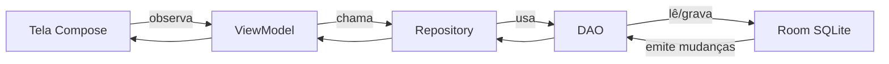

# App Academia — Documentação Técnica

> Sistema mobile para gerenciamento de academia  
> **Desenvolvedor:** Robert Lindomar Fernandes De Sousa  
> **Stack:** Kotlin · Jetpack Compose · MVVM · Room · StateFlow

---

## Índice

1. [Visão geral](#visão-geral)
2. [Arquitetura MVVM](#arquitetura-mvvm)
3. [Estrutura de pastas](#estrutura-de-pastas)
4. [Camada de entrada](#camada-de-entrada)
5. [Navegação](#navegação)
6. [Camada de dados](#camada-de-dados)
7. [Repositórios](#repositórios)
8. [ViewModels](#viewmodels)
9. [Telas (UI)](#telas-ui)
10. [Componentes reutilizáveis](#componentes-reutilizáveis)
11. [Tema visual](#tema-visual)
12. [Utilitários](#utilitários)
13. [Fluxos de uso](#fluxos-de-uso)
14. [Regras de negócio](#regras-de-negócio)

---

## Visão geral

O aplicativo permite **cadastrar, listar, editar e excluir** alunos, planos, treinos e pagamentos. Os dados ficam salvos localmente no dispositivo usando **Room (SQLite)** e sobrevivem ao fechar o app.

| Módulo      | Cadastro | Listagem | Edição | Exclusão | Extra                          |
| :---------- | :------: | :------: | :----: | :------: | :----------------------------- |
| Alunos      |    ✅    |    ✅    |   ✅   |    ✅    | Ativar / inativar              |
| Planos      |    ✅    |    ✅    |   ✅   |    ✅    | —                              |
| Treinos     |    ✅    |    ✅    |   ✅   |    ✅    | Vinculado ao aluno             |
| Pagamentos  |    ✅    |    ✅    |   ✅   |    ✅    | Marcar como pago               |
| Dashboard   |    —     |    ✅    |   —    |    —     | Resumo com totais              |
| Sobre       |    —     |    ✅    |   —    |    —     | Informações do projeto         |

---

## Arquitetura MVVM

O projeto separa responsabilidades em camadas. A **View** (Compose) não acessa o banco diretamente.



| Camada         | Pasta            | Responsabilidade                                      |
| :------------- | :--------------- | :---------------------------------------------------- |
| **View**       | `ui/`            | Exibir interface e capturar cliques/digitação         |
| **ViewModel**  | `viewmodel/`     | Estado da tela, validações e chamadas ao repositório  |
| **Repository** | `data/repository/` | Abstrair acesso aos dados                           |
| **DAO**        | `data/dao/`      | Consultas SQL geradas pelo Room                       |
| **Model**      | `data/entity/`   | Estrutura das tabelas do banco                        |

### Fluxo de dados (StateFlow)

| Etapa | O que acontece                                                        |
| :---: | :-------------------------------------------------------------------- |
| **1** | Usuário interage na tela (ex.: toca em Salvar)                        |
| **2** | Tela chama função do ViewModel (ex.: `salvar()`)                      |
| **3** | ViewModel valida e chama o Repository                                 |
| **4** | Repository executa operação no DAO                                    |
| **5** | Room grava no SQLite                                                  |
| **6** | DAO emite novo valor via `Flow`                                       |
| **7** | ViewModel atualiza o `StateFlow`                                      |
| **8** | Compose recompõe a tela automaticamente                               |

---

## Estrutura de pastas

```
app/src/main/java/com/example/appacademia/
│
├── MainActivity.kt              # Ponto de entrada do app
├── AcademiaApplication.kt       # Inicialização global (banco + repos)
│
├── data/
│   ├── entity/                  # Modelos das tabelas
│   ├── dao/                     # Interfaces SQL (Room)
│   ├── database/                # Configuração do banco
│   └── repository/              # Camada de acesso aos dados
│
├── viewmodel/                   # Lógica e estado das telas
│
├── ui/
│   ├── screens/                 # Telas completas
│   ├── components/              # Peças reutilizáveis de UI
│   ├── navigation/              # Rotas e NavHost
│   └── theme/                   # Cores, fontes, formas
│
└── util/                        # Funções auxiliares (formatação)
```

---

## Camada de entrada

### `MainActivity.kt`

Primeira classe executada quando o usuário abre o app.

| Elemento                  | Função                                                    |
| :------------------------ | :-------------------------------------------------------- |
| `onCreate()`              | Inicializa a activity                                     |
| `enableEdgeToEdge()`      | App ocupa a tela inteira (visual moderno)               |
| `AcademiaApplication`     | Obtém banco e repositórios                                |
| `ViewModelFactory.criar()`| Cria ViewModels com dependências injetadas                |
| `AppAcademiaTheme`        | Aplica tema Material 3 (cores, tipografia)                |
| `rememberNavController()` | Controlador de navegação entre telas                      |
| `AcademiaNavHost`         | Define qual tela exibir em cada rota                      |

### `AcademiaApplication.kt`

Classe global registrada no `AndroidManifest.xml`. Vive durante todo o ciclo do app.

| Propriedade            | Tipo                  | Descrição                                      |
| :--------------------- | :-------------------- | :--------------------------------------------- |
| `banco`                | `AppDatabase`         | Instância única do Room (singleton)            |
| `alunoRepositorio`     | `AlunoRepositorio`    | CRUD de alunos + exclusão em cascata           |
| `planoRepositorio`     | `PlanoRepositorio`    | CRUD de planos                                 |
| `treinoRepositorio`    | `TreinoRepositorio`   | CRUD de treinos                                |
| `pagamentoRepositorio` | `PagamentoRepositorio`| CRUD de pagamentos + marcar como pago          |

---

## Navegação

### `Rotas.kt`

Define constantes com os nomes das rotas.

| Constante    | Valor         | Tela destino        |
| :----------- | :------------ | :------------------ |
| `INICIO`     | `"inicio"`    | Tela inicial        |
| `ALUNOS`     | `"alunos"`    | Gestão de alunos    |
| `PLANOS`     | `"planos"`    | Gestão de planos    |
| `TREINOS`    | `"treinos"`   | Gestão de treinos   |
| `PAGAMENTOS` | `"pagamentos"`| Gestão de pagamentos|
| `SOBRE`      | `"sobre"`     | Informações         |

### `AcademiaNavHost.kt`

Monta o grafo de navegação. Cada rota associa uma tela ao seu ViewModel.

| Rota         | Tela               | ViewModel            | Ação voltar              |
| :----------- | :----------------- | :------------------- | :----------------------- |
| `INICIO`     | `InicioScreen`     | `DashboardViewModel` | —                        |
| `ALUNOS`     | `AlunosScreen`     | `AlunoViewModel`     | `popBackStack()`         |
| `PLANOS`     | `PlanosScreen`     | `PlanoViewModel`     | `popBackStack()`         |
| `TREINOS`    | `TreinosScreen`    | `TreinoViewModel`    | `popBackStack()`         |
| `PAGAMENTOS` | `PagamentosScreen` | `PagamentoViewModel` | `popBackStack()`         |
| `SOBRE`      | `SobreScreen`      | —                    | `popBackStack()`         |

---

## Camada de dados

### Entidades (`data/entity/`)

Cada classe vira uma **tabela** no SQLite.

#### `Aluno.kt` → tabela `alunos`

| Campo           | Tipo      | Obrigatório | Descrição                    |
| :-------------- | :-------- | :---------: | :--------------------------- |
| `id`            | `Long`    |     auto    | Chave primária               |
| `nome`          | `String`  |     ✅      | Nome completo                |
| `cpf`           | `String`  |     ✅      | CPF do aluno                 |
| `telefone`      | `String`  |     —       | Telefone (opcional)          |
| `email`         | `String`  |     —       | E-mail (opcional)            |
| `ativo`         | `Boolean` |     —       | `true` = ativo (padrão)      |
| `dataCadastro`  | `Long`    |     auto    | Data em milissegundos        |

#### `Plano.kt` → tabela `planos`

| Campo            | Tipo     | Obrigatório | Descrição                |
| :--------------- | :------- | :---------: | :----------------------- |
| `id`             | `Long`   |     auto    | Chave primária           |
| `nome`           | `String` |     ✅      | Nome do plano            |
| `descricao`      | `String` |     —       | Descrição opcional       |
| `valor`          | `Double` |     ✅      | Valor em reais (> 0)     |
| `duracaoEmDias`  | `Int`    |     —       | Duração (padrão: 30)     |

#### `Treino.kt` → tabela `treinos`

| Campo        | Tipo     | Obrigatório | Descrição                         |
| :----------- | :------- | :---------: | :-------------------------------- |
| `id`         | `Long`   |     auto    | Chave primária                    |
| `alunoId`    | `Long`   |     ✅      | ID do aluno vinculado             |
| `nomeAluno`  | `String` |     ✅      | Nome (cópia para exibição rápida)  |
| `descricao`  | `String` |     —       | Descrição do treino               |
| `objetivo`   | `String` |     —       | Objetivo do treino                |
| `dataInicio` | `Long`   |     auto    | Data de início                    |

#### `Pagamento.kt` → tabela `pagamentos`

| Campo             | Tipo      | Obrigatório | Descrição                        |
| :---------------- | :-------- | :---------: | :------------------------------- |
| `id`              | `Long`    |     auto    | Chave primária                   |
| `alunoId`         | `Long`    |     ✅      | ID do aluno vinculado            |
| `nomeAluno`       | `String`  |     ✅      | Nome (cópia para exibição)       |
| `valor`           | `Double`  |     ✅      | Valor em reais (> 0)             |
| `dataVencimento`  | `Long`    |     ✅      | Data de vencimento               |
| `pago`            | `Boolean` |     —       | `false` = pendente (padrão)      |

---

### DAOs (`data/dao/`)

Interfaces que o Room transforma em SQL. Métodos com `Flow` **atualizam a UI automaticamente** quando o banco muda.

#### `AlunoDao.kt`

| Método              | SQL / Ação                        | Retorno          |
| :------------------ | :-------------------------------- | :--------------- |
| `observarTodos()`   | `SELECT * FROM alunos`            | `Flow<List<Aluno>>` |
| `observarAtivos()`  | `WHERE ativo = 1`                 | `Flow<List<Aluno>>` |
| `contarTodos()`     | `COUNT(*)`                        | `Flow<Int>`      |
| `inserir()`         | `INSERT`                          | `Long` (novo id) |
| `atualizar()`       | `UPDATE`                          | —                |
| `excluir()`         | `DELETE`                          | —                |
| `buscarPorId()`     | `WHERE id = :id`                  | `Aluno?`         |

#### `PlanoDao.kt`

| Método            | Ação     | Retorno              |
| :---------------- | :------- | :------------------- |
| `observarTodos()` | SELECT   | `Flow<List<Plano>>`  |
| `contarTodos()`   | COUNT    | `Flow<Int>`          |
| `inserir()`       | INSERT   | `Long`               |
| `atualizar()`     | UPDATE   | —                    |
| `excluir()`       | DELETE   | —                    |

#### `TreinoDao.kt`

| Método               | Ação                              | Retorno               |
| :------------------- | :-------------------------------- | :-------------------- |
| `observarTodos()`    | SELECT ordenado por data          | `Flow<List<Treino>>`  |
| `contarTodos()`      | COUNT                             | `Flow<Int>`           |
| `inserir()`          | INSERT                            | `Long`                |
| `atualizar()`        | UPDATE                            | —                     |
| `excluir()`          | DELETE                            | —                     |
| `excluirPorAluno()`  | DELETE WHERE alunoId = :id        | — (cascata)           |

#### `PagamentoDao.kt`

| Método               | Ação                              | Retorno                  |
| :------------------- | :-------------------------------- | :----------------------- |
| `observarTodos()`    | SELECT ordenado por vencimento    | `Flow<List<Pagamento>>`  |
| `contarPendentes()`  | COUNT WHERE pago = 0              | `Flow<Int>`              |
| `inserir()`          | INSERT                            | `Long`                   |
| `atualizar()`        | UPDATE                            | —                        |
| `excluir()`          | DELETE                            | —                        |
| `excluirPorAluno()`  | DELETE WHERE alunoId = :id        | — (cascata)              |

---

### `AppDatabase.kt`

| Elemento           | Descrição                                              |
| :----------------- | :----------------------------------------------------- |
| `@Database`        | Declara as 4 entidades, versão 1                       |
| Arquivo gerado     | `academia_banco.db` no armazenamento interno           |
| `obterInstancia()` | Padrão **Singleton** — uma única instância no app      |
| DAOs expostos      | `alunoDao()`, `planoDao()`, `treinoDao()`, `pagamentoDao()` |

---

## Repositórios

Camada intermediária entre ViewModel e DAO. Centraliza regras de acesso.

### `AlunoRepositorio.kt`

| Função            | O que faz                                              |
| :---------------- | :----------------------------------------------------- |
| `observarTodos()` | Lista todos os alunos                                  |
| `observarAtivos()`| Lista só alunos ativos (usado em treinos/pagamentos)   |
| `contarTodos()`   | Contagem para o dashboard                              |
| `inserir()`       | Cadastra novo aluno                                    |
| `atualizar()`     | Edita aluno existente                                  |
| `alternarAtivo()` | Inverte `ativo` (true ↔ false)                         |
| `excluir()`       | **Cascata:** treinos → pagamentos → aluno              |

### `PlanoRepositorio.kt`

| Função            | O que faz              |
| :---------------- | :--------------------- |
| `observarTodos()` | Lista planos           |
| `contarTodos()`   | Contagem no dashboard  |
| `inserir()`       | Novo plano             |
| `atualizar()`     | Editar plano           |
| `excluir()`       | Remover plano          |

### `TreinoRepositorio.kt`

| Função            | O que faz              |
| :---------------- | :--------------------- |
| `observarTodos()` | Lista treinos          |
| `contarTodos()`   | Contagem no dashboard  |
| `inserir()`       | Novo treino            |
| `atualizar()`     | Editar treino          |
| `excluir()`       | Remover treino         |

### `PagamentoRepositorio.kt`

| Função            | O que faz                        |
| :---------------- | :------------------------------- |
| `observarTodos()` | Lista pagamentos                 |
| `contarPendentes()`| Contagem de não pagos no dashboard |
| `inserir()`       | Novo pagamento                   |
| `atualizar()`     | Editar pagamento                 |
| `excluir()`       | Remover pagamento                |
| `marcarComoPago()`| Define `pago = true`             |

---

## ViewModels

Cada ViewModel expõe um **`StateFlow`** que a tela observa. Quando o estado muda, a UI atualiza sozinha.

### `ViewModelFactory.kt`

| Função / Método | O que faz                                           |
| :-------------- | :-------------------------------------------------- |
| `create()`      | Instancia o ViewModel correto para cada tela        |
| `criar()`       | Monta a factory com os repositórios da Application  |

### `DashboardViewModel.kt`

| Campo no estado              | Origem                    |
| :--------------------------- | :------------------------ |
| `totalAlunos`                | `alunoRepositorio.contarTodos()` |
| `totalPlanos`                | `planoRepositorio.contarTodos()` |
| `totalTreinos`               | `treinoRepositorio.contarTodos()` |
| `totalPagamentosPendentes`   | `pagamentoRepositorio.contarPendentes()` |

Usa `combine()` para juntar os 4 Flows em um único estado.

---

### `AlunoViewModel.kt`

#### Estado (`AlunoUiEstado`)

| Campo                   | Tipo            | Uso                              |
| :---------------------- | :-------------- | :------------------------------- |
| `alunos`                | `List<Aluno>`   | Lista exibida na tela            |
| `nome`, `cpf`, etc.     | `String`        | Campos do formulário             |
| `mensagemErro`          | `String?`       | Erro de validação                |
| `exibirDialogo`         | `Boolean`       | Mostrar/ocultar formulário       |
| `editandoId`            | `Long?`         | `null` = novo · preenchido = edição |
| `exibirDialogoExclusao` | `Boolean`       | Diálogo de confirmação           |
| `itemParaExcluir`       | `Aluno?`        | Aluno marcado para exclusão      |

#### Funções

| Função               | O que faz                                      |
| :------------------- | :--------------------------------------------- |
| `abrirDialogo()`     | Abre formulário vazio para novo cadastro       |
| `abrirEdicao()`      | Abre formulário preenchido com dados do aluno  |
| `fecharDialogo()`    | Fecha o formulário e limpa erros               |
| `atualizarNome()`    | Atualiza campo nome enquanto digita            |
| `atualizarCpf()`     | Atualiza campo CPF                             |
| `atualizarTelefone()`| Atualiza telefone                              |
| `atualizarEmail()`   | Atualiza e-mail                                |
| `salvar()`           | Valida e insere ou atualiza no banco           |
| `alternarAtivo()`    | Liga/desliga status ativo do aluno             |
| `solicitarExclusao()`| Abre confirmação de exclusão                   |
| `confirmarExclusao()`| Exclui aluno + treinos + pagamentos vinculados |
| `cancelarExclusao()` | Cancela a exclusão                             |

---

### `PlanoViewModel.kt`

| Função        | Validação / Regra                          |
| :------------ | :----------------------------------------- |
| `salvar()`    | Nome obrigatório · valor deve ser > 0      |
| Demais funções| Mesmo padrão do `AlunoViewModel`           |

---

### `TreinoViewModel.kt`

| Função     | Validação / Regra                                    |
| :--------- | :--------------------------------------------------- |
| `salvar()` | Aluno obrigatório · descrição **ou** objetivo preenchido |
| `init`     | Observa treinos **e** lista de alunos ativos         |

---

### `PagamentoViewModel.kt`

| Função            | Validação / Regra                                       |
| :---------------- | :------------------------------------------------------ |
| `salvar()`        | Aluno obrigatório · valor > 0                           |
| `salvar()`        | Calcula vencimento: hoje + N dias                       |
| `marcarComoPago()`| Altera `pago` para `true` sem excluir o registro        |
| Edição            | Preserva status `pago` e recalcula vencimento           |

---

## Telas (UI)

Todas seguem o mesmo padrão estrutural:

```
Scaffold
 ├── TopBar (AcademiaTopBar)
 ├── FundoTela (gradiente)
 │    ├── LazyColumn com cards  — ou —
 │    └── EstadoVazio (lista vazia)
 ├── FabAcademia (+)
 ├── AlertDialog (cadastro / edição)
 └── DialogConfirmacaoExclusao
```

| Arquivo              | Responsabilidade principal                              |
| :------------------- | :------------------------------------------------------ |
| `InicioScreen.kt`    | Dashboard 2×2 + menu de navegação com ícones            |
| `AlunosScreen.kt`    | Cards de aluno, switch ativo/inativo, editar/excluir    |
| `PlanosScreen.kt`    | Cards de plano com valor formatado em R$                |
| `TreinosScreen.kt`   | Cards de treino + dropdown de aluno no formulário       |
| `PagamentosScreen.kt`| Cards com cor por status + botão "Marcar como pago"     |
| `SobreScreen.kt`     | Cards informativos sobre o projeto e o desenvolvedor    |

### Como a tela observa o ViewModel

```kotlin
val estado by viewModel.estado.collectAsStateWithLifecycle()
```

Sempre que `estado` muda no ViewModel, o Compose **redesenha** a tela.

---

## Componentes reutilizáveis

| Arquivo                        | O que faz                                         |
| :----------------------------- | :------------------------------------------------ |
| `AcademiaTopBar.kt`            | Barra superior com gradiente azul e botão voltar  |
| `CardMenu.kt`                  | Item do menu na home (ícone + título + seta)       |
| `CardEstatistica.kt`           | Card do dashboard com número grande e ícone       |
| `CampoTexto.kt`                | Campo de texto padronizado para formulários       |
| `ChipStatus.kt`                | Badge colorido (Ativo, Pago, Atrasado…)           |
| `EstadoVazio.kt`               | Placeholder quando a lista está vazia             |
| `FabAcademia.kt`               | Botão flutuante (+) laranja                       |
| `FundoTela.kt`                 | Gradiente de fundo (claro / escuro)              |
| `BotoesAcaoCard.kt`            | Ícones Editar (azul) e Excluir (vermelho)         |
| `DialogConfirmacaoExclusao.kt` | Diálogo "Tem certeza que deseja excluir?"         |

---

## Tema visual

| Arquivo     | Conteúdo                                           |
| :---------- | :------------------------------------------------- |
| `Color.kt`  | Paleta: azul primário, laranja accent, cores de status |
| `Type.kt`   | Tipografia: títulos, corpo, labels                 |
| `Shape.kt`  | Cantos arredondados (8dp a 28dp)                   |
| `Theme.kt`  | `AppAcademiaTheme` — une tudo + suporte a Dark Mode |

### Cores de status

| Status              | Cor        | Onde aparece              |
| :------------------ | :--------- | :------------------------ |
| Aluno ativo         | Verde      | Card e chip do aluno      |
| Aluno inativo       | Cinza      | Card esmaecido            |
| Pagamento pago      | Verde      | Chip "Pago"               |
| Pagamento pendente  | Laranja    | Chip + fundo do card      |
| Pagamento atrasado  | Vermelho   | Chip + fundo vermelho claro |

---

## Utilitários

### `Formatadores.kt`

| Função                    | Entrada              | Saída              | Uso                        |
| :------------------------ | :------------------- | :----------------- | :------------------------- |
| `formatarData()`          | `Long` (milissegundos)| `01/03/2025`      | Exibir datas nas listas    |
| `formatarMoeda()`         | `99.9`               | `R$ 99,90`         | Valores de planos/pagamentos |
| `inicioDoDiaAtual()`      | —                    | Meia-noite de hoje | Calcular vencimento        |
| `pagamentoEstaAtrasado()` | data + pago          | `true` / `false`   | Destaque visual vermelho   |

---

## Fluxos de uso

### Cadastrar um aluno

| # | Quem        | Ação                                           |
| :-: | :---------- | :--------------------------------------------- |
| 1 | Usuário     | Toca no botão **+**                            |
| 2 | Tela        | Chama `viewModel.abrirDialogo()`               |
| 3 | Usuário     | Preenche nome, CPF, telefone, e-mail           |
| 4 | Usuário     | Toca em **Salvar**                             |
| 5 | ViewModel   | Valida campos obrigatórios                     |
| 6 | ViewModel   | Chama `alunoRepositorio.inserir()`             |
| 7 | Room        | Grava no SQLite                                |
| 8 | DAO         | Emite lista atualizada via `Flow`              |
| 9 | ViewModel   | Atualiza `estado.alunos`                       |
| 10| Tela        | Lista aparece com o novo aluno automaticamente |

### Excluir um aluno (com cascata)

| # | Quem        | Ação                                           |
| :-: | :---------- | :--------------------------------------------- |
| 1 | Usuário     | Toca no ícone **Excluir** no card               |
| 2 | ViewModel   | `solicitarExclusao()` — abre confirmação       |
| 3 | Usuário     | Confirma exclusão                              |
| 4 | Repository  | Apaga treinos do aluno                         |
| 5 | Repository  | Apaga pagamentos do aluno                        |
| 6 | Repository  | Apaga o aluno                                  |
| 7 | Dashboard   | Totais atualizam automaticamente               |

### Marcar pagamento como pago

| # | Quem        | Ação                                           |
| :-: | :---------- | :--------------------------------------------- |
| 1 | Usuário     | Toca em **Marcar como pago**                   |
| 2 | ViewModel   | `marcarComoPago(pagamento)`                    |
| 3 | Repository  | `pagamento.copy(pago = true)` → `atualizar()`  |
| 4 | Tela        | Card muda de cor · chip vira "Pago" · botão some |

---

## Regras de negócio

| Regra                              | Onde é validada          | Comportamento na UI                    |
| :--------------------------------- | :----------------------- | :------------------------------------- |
| Nome e CPF obrigatórios (aluno)    | `AlunoViewModel.salvar()`| Mensagem de erro no diálogo            |
| Valor do plano > 0                 | `PlanoViewModel.salvar()`| Mensagem de erro no diálogo            |
| Treino vinculado a aluno           | `TreinoViewModel.salvar()`| Dropdown de alunos ativos             |
| Pagamento vinculado a aluno        | `PagamentoViewModel.salvar()`| Dropdown de alunos ativos          |
| Pagamento atrasado com destaque    | `PagamentosScreen`       | Card vermelho + chip "Atrasado"        |
| Aluno inativo com destaque         | `AlunosScreen`           | Card esmaecido + chip cinza "Inativo"  |
| Exclusão de aluno em cascata       | `AlunoRepositorio.excluir()`| Remove treinos e pagamentos também  |

---

## Tecnologias utilizadas

| Tecnologia            | Versão / Lib              | Papel no projeto                |
| :-------------------- | :------------------------ | :------------------------------ |
| Kotlin                | —                         | Linguagem principal             |
| Jetpack Compose       | BOM                       | Interface declarativa           |
| Material Design 3     | `material3`               | Componentes visuais             |
| Navigation Compose  | `navigation-compose`      | Navegação entre telas           |
| Room                  | `room-runtime` + KSP      | Banco SQLite local              |
| StateFlow             | Kotlin Coroutines         | Estado reativo da UI            |
| ViewModel             | `lifecycle-viewmodel`     | Lógica sobrevive a rotações     |
| Coroutines            | `kotlinx-coroutines`      | Operações assíncronas no banco  |

---

*Documentação gerada para o projeto acadêmico App Academia — Robert Lindomar Fernandes De Sousa*
